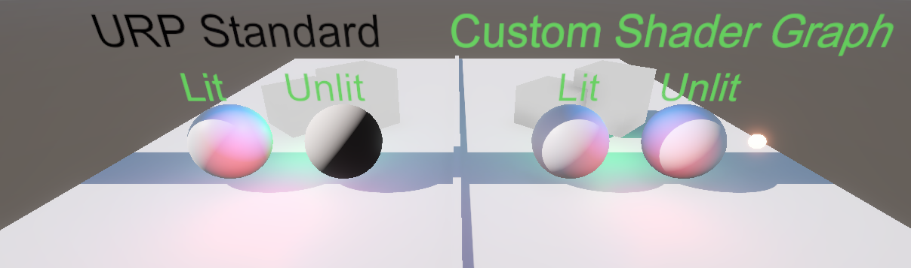

# Unity Custom ShaderGraph-Unlit-With-Shadow

**Unity의 Shader Graph 커스터마이징을 통해 직접 키워드를 정의할 필요 없이 Main Light 및 Shadow Node를 사용하는 레포지토리.**  

<details>  
  <summary>English</summary> 
This repository enables the use of a MainLight and Shadow Node through Unity's Custom Shader Graph without requiring manual keyword definitions.
</details>  
<br></br>

 

## 요약 / Summary
이 레포지토리는 Unity의 Shader Graph를 커스터마이징하여 새로운 Graph를 추가함으로써, Unlit Shader 에서도 Main Light를 완전하게 사용 가능하도록 하는 레포지토리입니다.  

유니티의 각종 쉐이더 함수들을 사용하기 위하여 Keyword를 직접 정의할 필요 없이 일반 Lit Shader 와 동등하게 키워드를 적용받을 수 있습니다.  

이를 통해 _MAIN_LIGHT_SHADOWS_CASCADE 등의 키워드를 직접 정의할 필요 없이 즉시 Main Light를 사용하는 등의 응용이 가능해집니다.  

키워드 정의를 필요로 하는 커스텀 노드 라이브러리들과 호환이 가능합니다.  

<details>  
  <summary>English</summary>  

This repository extends Unity's Shader Graph capabilities through custom graph implementation, enabling full and seamless integration of Main Light functionality even within Unlit shaders.

The solution provides automatic access to Unity shader functions and keywords comparable to standard Lit Shaders, eliminating the need for manual keyword declarations like _MAIN_LIGHT_SHADOWS_CASCADE.

This implementation allows immediate utilization of Main Light features while maintaining compatibility with Unity's rendering pipeline. The architecture ensures native-level interoperability with custom node libraries that require predefined keyword configurations.

</details>

* * *

## Installation

This package can be installed using either **Direct Project Open** or **Unity Package Manager (UPM)**.  

  - Package Manager →  Install Package Manager from git URL
    ``` text
    https://github.com/jinhyeonseo01/Unity-CustomShaderGraph-Unlit-With-Shadow.git?path=/Assets/CustomShaderGraph
    ```
  - Alternatively, Clone the repository to your local
    *(Choose this option if direct customization is needed)*  

### Compatibility  

**Libraries That Work Well Together**  
 - [URP Shader Graph Custom Lighting Node](https://github.com/Cyanilux/URP_ShaderGraphCustomLighting)
   - A library that supports various light-related Shader Graph nodes.  

* * *

## 최신 테스트 버전 / Latest Tested Version  
- 테스트 완료 버전 **6000.0.42f URP** (*Latest tested version: **6000.0.42f URP***)  

## 시스템 요구 사항 / System Requirements

- Unity **6000.0.9f0** 이상 (*Unity **6000.0.9f0** or later*)  
- Shader Graph **17.0.3** 이상 (*Shader Graph **17.0.3** or later*)  

* * *

## 예제 가이드 / Example Guide

아래 이미지를 통해 셰이더의 적용 예시와 가이드를 확인할 수 있습니다.  
The images below illustrate examples and guides for applying the shader.

  
  

  

